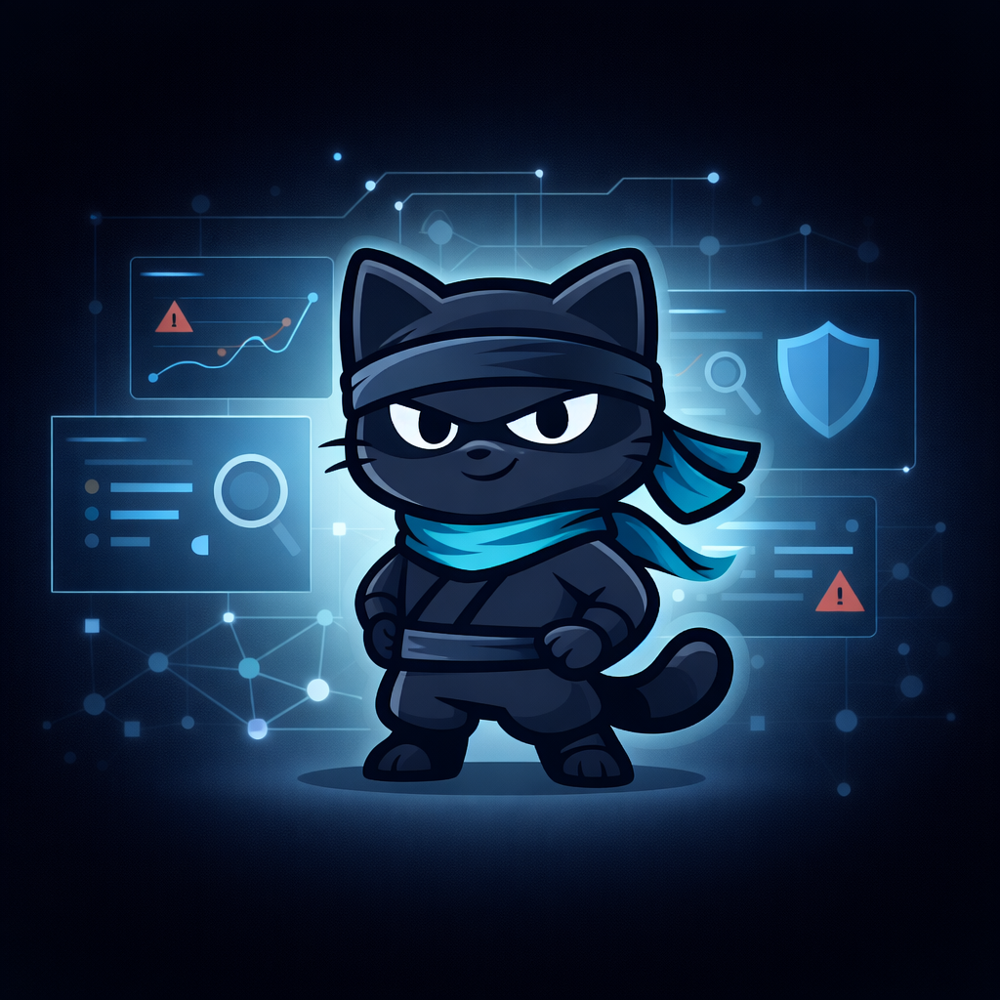

# Microsoft Ninja Training Hub (Unofficial Tracker)

## What is “Microsoft Ninja Training”?

**Microsoft Ninja Training** is a community-friendly collection of *free, structured learning paths* published (mostly) by Microsoft product teams on Microsoft Tech Community and related hubs.  
They’re typically organized as **Fundamentals → Intermediate → Advanced/Expert** (sometimes “Level 400”) and combine **videos, docs, labs, demos, and scenario-based guidance** so you can skill up on a product area fast—often with a strong focus on **real-world implementation and operations** (SecOps, compliance operations, engineering best practices).

> This page is a curated, ready-to-track list of Ninja trainings with short abstracts. (Last updated Feb. 27th 2026).

---

## Microsoft Security Copilot

- [ ] **Microsoft Security Copilot Ninja (Level 400)**  
  https://techcommunity.microsoft.com/blog/securitycopilotblog/how-to-become-a-microsoft-security-copilot-ninja-the-complete-level-400-training/4106928  
  *Covers:* onboarding + core concepts, prompt patterns, plugins/integrations, and practical SOC workflows/automation examples.

---

## Microsoft Sentinel (SIEM / SOAR)

- [ ] **Microsoft Sentinel Ninja (Level 400)**  
  https://techcommunity.microsoft.com/blog/microsoftsentinelblog/become-a-microsoft-sentinel-ninja-the-complete-level-400-training/1246310  
  *Covers:* SIEM/SOAR foundations through advanced detection engineering and operations (end-to-end Sentinel).

- [ ] **Microsoft Sentinel Automation Ninja**  
  https://techcommunity.microsoft.com/blog/microsoftsentinelblog/become-a-microsoft-sentinel-automation-ninja/3563377  
  *Covers:* automation patterns with playbooks and workflows; deep dives and practical SOAR guidance.

- [ ] **Microsoft Sentinel Notebooks Ninja (series)**  
  https://techcommunity.microsoft.com/t5/microsoft-sentinel-blog/becoming-a-microsoft-sentinel-notebooks-ninja-the-series/ba-p/2693491  
  *Covers:* notebook-driven hunting and investigation workflows; analysis patterns for deeper detections.

---

## Microsoft Defender (XDR + workload products)

- [ ] **Microsoft Defender XDR Ninja**  
  https://aka.ms/m365dninja  
  *Covers:* unified SecOps in Defender XDR; investigation, threat intel, advanced hunting (KQL), automation/AIR, attack disruption, integrations/APIs (structured Fundamentals → Expert).

- [ ] **Microsoft Defender for Endpoint Ninja**  
  https://techcommunity.microsoft.com/blog/microsoftdefenderatpblog/become-a-microsoft-defender-for-endpoint-ninja/1515647  
  *Covers:* device protection and detection/response; investigations, operations, and best practices (role-based path).

- [ ] **Microsoft Defender for Identity Ninja**  
  https://techcommunity.microsoft.com/blog/microsoft-security-blog/microsoft-defender-for-identity-ninja-training/2117904  
  *Covers:* identity threat detection using AD signals; investigations of compromised identities and advanced threats.

- [ ] **Microsoft Defender for Office 365 Ninja**  
  https://techcommunity.microsoft.com/blog/microsoftdefenderforoffice365blog/become-a-microsoft-defender-for-office-365-ninja--june-2022/2187392  
  *Covers:* email threat protection + SecOps workflows; anti-phish/malware, Safe Links/Attachments, investigations (Fundamentals → Advanced).

- [ ] **Microsoft Defender for Cloud Apps Ninja (MDCA)**  
  https://techcommunity.microsoft.com/blog/microsoft-security-blog/microsoft-defender-for-cloud-apps-ninja-training--june-2022/2751518  
  *Covers:* SaaS security posture + protection; shadow IT discovery, app governance, policies, and investigations.

- [ ] **Microsoft Defender for Cloud Ninja**  
  https://techcommunity.microsoft.com/blog/microsoftdefendercloudblog/become-a-microsoft-defender-for-cloud-ninja/1608761  
  *Covers:* CNAPP concepts; posture management + workload protections; alerting/detections and integrations.

- [ ] **Microsoft Defender for IoT Ninja**  
  https://techcommunity.microsoft.com/blog/microsoftdefenderatpblog/microsoft-defender-for-iot-ninja-training/2428899  
  *Covers:* OT/IoT security; architecture, monitoring, and operational scenarios in Defender for IoT.

- [ ] **Microsoft Defender Threat Intelligence (MDTI) Ninja (Level 400)**  
  https://techcommunity.microsoft.com/blog/defenderthreatintelligence/become-an-mdti-ninja-the-complete-level-400-training/3656965  
  *Covers:* intelligence-driven investigations and operationalizing threat intel in day-to-day SecOps.

- [ ] **Microsoft Defender Vulnerability Management Ninja**  
  https://techcommunity.microsoft.com/blog/vulnerability-management/become-a-microsoft-defender-vulnerability-management-ninja/4003011  
  *Covers:* building and running a vulnerability management program using Microsoft’s VM capabilities.

- [ ] **Microsoft Defender Experts Ninja Hub**  
  https://techcommunity.microsoft.com/blog/microsoftsecurityexperts/welcome-to-the-microsoft-defender-experts-ninja-hub/4442210  
  *Covers:* curated getting-started + continuous learning resources for Defender Experts managed services.

---

## Microsoft Security (Operations / Programs)

- [ ] **Microsoft Security Exposure Management Ninja (MSEM)**  
  https://techcommunity.microsoft.com/blog/securityexposuremanagement/microsoft-security-exposure-management-ninja-training/4444285  
  *Covers:* exposure management concepts + implementation scenarios; how to plan and operationalize MSEM.

- [ ] **Microsoft Incident Response Ninja Hub**  
  https://techcommunity.microsoft.com/blog/microsoftsecurityexperts/welcome-to-the-microsoft-incident-response-ninja-hub/4243594  
  *Covers:* IR guidance, playbooks, case studies, hunting tips, and practical “how we do it” resources.

- [ ] **Virtual Ninja Show (ongoing video series)**  
  https://aka.ms/NinjaShow  
  *Covers:* recurring video episodes across Microsoft Security topics (episode-based learning).

---

## Azure

- [ ] **Azure Network Security Ninja**  
  https://techcommunity.microsoft.com/blog/azurenetworksecurityblog/azure-network-security-ninja-training/2356101  
  *Covers:* Azure network security from basics to advanced design and operations (updated over time).

---

## Microsoft Purview (Compliance / Risk / Governance)

- [ ] **Purview Information Protection Ninja**  
  https://aka.ms/MIPNinja  
  *Covers:* classification + sensitivity labeling fundamentals through advanced protection scenarios; curated docs/videos/guides.

- [ ] **Purview Data Loss Prevention (DLP) Ninja**  
  https://aka.ms/DLPNinja  
  *Covers:* DLP policy design and operations, reporting, common scenarios, and practical governance guidance.

- [ ] **Purview eDiscovery Ninja**  
  https://techcommunity.microsoft.com/blog/microsoft-security-blog/become-a-microsoft-purview-ediscovery-ninja/2793108  
  *Covers:* eDiscovery workflows, case handling, and solution mastery from beginner to advanced.

- [ ] **Purview Insider Risk Management Ninja**  
  https://techcommunity.microsoft.com/blog/microsoft-security-blog/become-an-insider-risk-management-ninja/3282306  
  *Covers:* insider risk policies and investigations; signals, privacy-by-design concepts, and operational usage.

- [ ] **Purview Data Lifecycle & Records Management Ninja**  
  https://techcommunity.microsoft.com/blog/microsoft-security-blog/become-a-microsoft-purview-data-lifecycle-and-records-management-ninja/3874829  
  *Covers:* retention + records management; labels/policies, scenarios, prerequisites, and common patterns.

- [ ] **Purview Communication Compliance Ninja**  
  https://aka.ms/communicationcomplianceninja  
  *Covers:* policy-driven detection + review workflows for regulatory/business conduct scenarios (investigations + reporting).

- [ ] **Purview Compliance Manager Ninja**  
  https://aka.ms/compliancemanagerninja  
  *Covers:* assessments, controls mapping, improvement actions, and operational compliance management using Compliance Manager.

- [ ] **Microsoft Priva Ninja**  
  https://techcommunity.microsoft.com/t5/security-compliance-and-identity/become-a-microsoft-priva-ninja/ba-p/3876888  
  *Covers:* privacy risk management and related scenarios; curated videos, docs, and learning paths.
